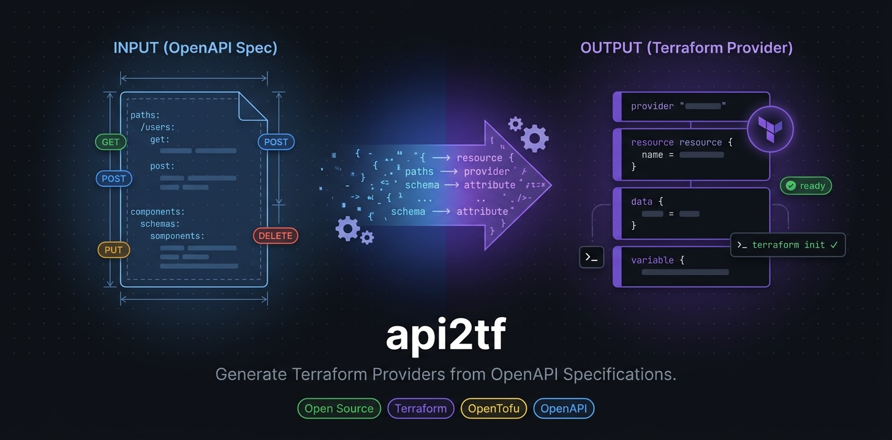

<p align="center">
  
</p>

<p align="center">
  <strong>Generate complete, production-ready Terraform providers from any OpenAPI specification.</strong>
</p>

<p align="center">
  <a href="https://pypi.org/project/api2tf/"></a>
  <a href="https://pypi.org/project/api2tf/"></a>
  <a href="https://github.com/gofireflyio/api2tf/actions"></a>
  <a href="LICENSE"></a>
  <a href="https://github.com/gofireflyio/api2tf/stargazers"></a>
</p>

<p align="center">
  <a href="#install">Install</a> &middot;
  <a href="#quick-start">Quick Start</a> &middot;
  <a href="#key-benefits">Key Benefits</a> &middot;
  <a href="#ai-assisted-analysis---smart">AI Analysis</a> &middot;
  <a href="#using-your-provider-locally">Local Usage</a> &middot;
  <a href="#publishing-to-the-terraform-registry">Registry Publishing</a> &middot;
  <a href="#cli-reference">CLI Reference</a> &middot;
  <a href="DESIGN.md">Architecture</a>
</p>

---

## Why api2tf?

Every SaaS product with a REST API eventually gets asked: _"Do you have a Terraform provider?"_ Building one from scratch takes **weeks to months** of Go boilerplate, CRUD wiring, and ongoing maintenance. api2tf turns that into a **single command**.

Unlike HashiCorp's [`terraform-plugin-codegen-openapi`](https://github.com/hashicorp/terraform-plugin-codegen-openapi) which only generates schema stubs and requires a hand-written YAML mapping config, api2tf **auto-detects CRUD patterns** from REST conventions and generates the full provider — HTTP client, authentication, Create/Read/Update/Delete implementations, acceptance tests, and Terraform examples — all ready to compile and publish.

## Install

```bash
docker pull ghcr.io/gofireflyio/api2tf
```

Or build it yourself:

```bash
git clone https://github.com/gofireflyio/api2tf.git
cd api2tf
docker build -t ghcr.io/gofireflyio/api2tf .
```

> The container uses `/workspace` as its working directory. Mount any directory containing your spec files to `/workspace`.

## Quick Start

**Recommended: AI-assisted mode (`--smart`)** for best results — uses Claude to resolve ambiguous CRUD patterns, detect computed fields, and identify sensitive attributes:

```bash
# Inspect what api2tf detects (with AI analysis)
docker run --rm -v $(pwd):/workspace -e ANTHROPIC_API_KEY ghcr.io/gofireflyio/api2tf inspect your-api-spec.yaml --smart

# Generate a complete Terraform provider (with AI analysis)
docker run --rm -v $(pwd):/workspace -e ANTHROPIC_API_KEY ghcr.io/gofireflyio/api2tf generate your-api-spec.yaml --smart
```

Without an Anthropic API key, api2tf falls back to heuristic-only mode:

```bash
# Inspect using heuristics only
docker run --rm -v $(pwd):/workspace ghcr.io/gofireflyio/api2tf inspect your-api-spec.yaml

# Generate using heuristics only
docker run --rm -v $(pwd):/workspace ghcr.io/gofireflyio/api2tf generate your-api-spec.yaml

# Custom provider name and output directory
docker run --rm -v $(pwd):/workspace ghcr.io/gofireflyio/api2tf generate your-api-spec.yaml --provider-name myapi -o ./output/
```

### Example: Petstore API

```bash
$ docker run --rm -v $(pwd):/workspace ghcr.io/gofireflyio/api2tf inspect petstore.yaml

Provider: petstore
Base URL: https://petstore.example.com/v1
Auth:     api_key (header: X-Api-Key)

Resources (Full CRUD):
  petstore_pet ........... Create Read Update Delete (confidence: 3/3)
  petstore_owner ......... Create Read Delete        (confidence: 2/3)

Data Sources:
  petstore_pets .......... GET /pets
  petstore_owners ........ GET /owners

$ docker run --rm -v $(pwd):/workspace ghcr.io/gofireflyio/api2tf generate petstore.yaml
Generated terraform-provider-petstore/ (23 files)
```

## Key Benefits

### From Weeks to Minutes

Building a Terraform provider manually involves writing thousands of lines of Go boilerplate: schema definitions, CRUD functions, HTTP client code, model structs, type conversions, and state management. For a typical 20-resource API, you're looking at:

| Task | Manual effort | With api2tf |
|------|:---:|:---:|
| Schema definitions & model structs | 2-3 days | Instant |
| CRUD implementations (Create, Read, Update, Delete) | 1-2 weeks | Instant |
| HTTP client & auth wiring | 1-2 days | Instant |
| Acceptance test scaffolding | 2-3 days | Instant |
| Terraform examples & documentation | 1-2 days | Instant |
| **Ongoing maintenance** when the API changes | Hours per change | One command |

A real-world API with 200+ endpoints and 400+ schemas generates a **fully compilable** provider with 600+ Go files in under 30 seconds.

### Zero-Config CRUD Detection

api2tf doesn't need a mapping file. It understands REST conventions:

- `POST /users` → **Create**
- `GET /users/{id}` → **Read**
- `PUT /users/{id}` → **Update**
- `DELETE /users/{id}` → **Delete**
- `GET /users` → **List** (data source)

It handles nested resources (`/orgs/{org_id}/teams/{team_id}`), versioned paths (`/v1/users`), and non-standard patterns — with an optional `--smart` flag that uses AI to resolve ambiguities.

### Safe Incremental Updates

When your API evolves, you don't start over. api2tf uses a **three-layer file separation**:

| Layer | Pattern | Behavior |
|-------|---------|----------|
| Generated | `*_schema_gen.go`, `*_crud_gen.go` | Always regenerated — safe to overwrite |
| Override | `*_override.go` | **Never overwritten** — your custom validators, hooks, and logic are preserved |
| State | `.api2tf.state.json` | Tracks what was generated for incremental diffs |

Run `api2tf update new-spec.yaml ./terraform-provider-myapi/` and get a changelog of exactly what changed.

### Production-Grade Output

The generated provider follows HashiCorp's [Terraform Plugin Framework](https://developer.hashicorp.com/terraform/plugin/framework) and is structured for the [Terraform Registry](https://registry.terraform.io/):

- Proper `terraform-provider-{name}` directory layout
- `examples/` directory for registry documentation
- Acceptance test scaffolding per resource
- `ImportState` support out of the box
- Sensitive field detection (passwords, tokens, API keys)
- Enum validation where the spec defines allowed values

## AI-Assisted Analysis (`--smart`)

Real-world APIs don't always follow textbook REST conventions. The `--smart` flag sends a summary of your spec to [Claude](https://www.anthropic.com/claude) for analysis before code generation. The AI layer acts as a **pre-processor** — its recommendations are merged into an override config, keeping actual code generation fully deterministic.

**What it detects that heuristics can't:**

| Scenario | Heuristic guess | `--smart` correction |
|----------|:---:|:---:|
| `POST /search` | Create | Query / List (data source) |
| `PUT /config` | Update | Upsert (create-or-replace) |
| `POST /users/{id}/reset-password` | Create | Action (ignore for Terraform) |
| `GET /users/{id}/activity-log` | Read | Read-only sub-resource (data source) |
| `internal_score` field | Required | Computed (server-generated) |
| `x_trace_id` field | Optional | Computed (server-generated) |
| `billing_token` field | Optional | Sensitive |

**How it works:**

1. api2tf summarizes your endpoints (paths, methods, summaries, operation IDs) and sends them to Claude
2. Claude returns structured JSON with resource groupings, CRUD mappings, sensitive fields, and ignore paths
3. The analysis is written to `api2tf.override.yaml` for you to review and adjust
4. Code generation then uses the enhanced config — no LLM in the generation loop

**Usage:**

```bash
# Generate with AI analysis
docker run --rm -v $(pwd):/workspace -e ANTHROPIC_API_KEY ghcr.io/gofireflyio/api2tf generate my-spec.yaml --smart

# Or inspect only — generates the override config without writing provider code
docker run --rm -v $(pwd):/workspace -e ANTHROPIC_API_KEY ghcr.io/gofireflyio/api2tf inspect my-spec.yaml --smart
```

> The `--smart` flag works with `generate`, `inspect`, and `init` commands. It requires an [Anthropic API key](https://console.anthropic.com/) passed via `-e ANTHROPIC_API_KEY`.

## What Gets Generated

```
terraform-provider-{name}/
├── main.go                                    # Provider entry point
├── go.mod                                     # Go module (terraform-plugin-framework)
├── internal/
│   ├── provider/
│   │   ├── provider.go                        # Provider config + auth from securitySchemes
│   │   ├── provider_acc_test.go               # Provider test helpers
│   │   ├── resource_{noun}_schema_gen.go      # Schema + model (always regenerated)
│   │   ├── resource_{noun}_crud_gen.go        # CRUD operations (always regenerated)
│   │   ├── resource_{noun}_override.go        # Your customizations (never overwritten)
│   │   ├── resource_{noun}_acc_test.go        # Acceptance tests
│   │   ├── data_source_{noun}_schema_gen.go   # Data source schema
│   │   ├── data_source_{noun}_read_gen.go     # Data source read
│   │   └── data_source_{noun}_override.go     # Data source customizations
│   └── client/
│       ├── client.go                          # HTTP client with auth
│       └── {noun}.go                          # Per-resource API methods
└── examples/
    ├── provider/provider.tf                   # Provider configuration
    ├── resources/{noun}/resource.tf            # Resource examples
    └── data-sources/{noun}/data-source.tf     # Data source examples
```

## How It Works

```
OpenAPI Spec ──► Parse & Resolve $refs
                      │
                      ▼
               Infer CRUD Patterns ──► (Optional) AI Analysis with --smart
                      │
                      ▼
               Map Types to Terraform Plugin Framework
                      │
                      ▼
               Render Go Code via Jinja2 Templates
                      │
                      ▼
               Write Files (preserving _override.go)
```

1. **Parse** — Loads OpenAPI 3.0.x/3.1.x specs (JSON or YAML, local or URL), resolves all `$ref` references
2. **Infer** — Groups endpoints by resource, assigns CRUD roles from HTTP method + path patterns, detects ID fields from path parameters
3. **Map** — Converts OpenAPI types (`string`, `integer`, `array`, `object`) to Terraform Plugin Framework types (`types.String`, `types.Int64`, `types.List`, etc.)
4. **Generate** — Renders 16 Jinja2 templates into compilable Go source code
5. **Preserve** — Tracks generated state so `_override.go` files and manual edits are never lost

## Using Your Provider Locally

After generating your provider, you can use it locally for development and testing before publishing to any registry.

### Step 1: Compile the Provider

```bash
# Using Docker (no local Go required)
docker run --rm -v $(pwd)/terraform-provider-myapi:/app -w /app golang:1.22 sh -c "go mod tidy && go build -o terraform-provider-myapi ./..."

# Or locally (requires Go 1.22+)
cd terraform-provider-myapi
go mod tidy
go build -o terraform-provider-myapi
```

### Step 2: Install for Local Development

Use Terraform's [development overrides](https://developer.hashicorp.com/terraform/cli/config/config-file#development-overrides-for-provider-developers) to point Terraform at your local build.

Create or update `~/.terraformrc`:

```hcl
provider_installation {
  dev_overrides {
    "registry.terraform.io/myorg/myapi" = "/absolute/path/to/terraform-provider-myapi"
  }
  direct {}
}
```

### Step 3: Write Terraform Configuration

The `examples/` directory contains ready-to-use configuration files. Here's a typical setup:

```hcl
terraform {
  required_providers {
    myapi = {
      source = "registry.terraform.io/myorg/myapi"
    }
  }
}

provider "myapi" {
  # api_key = "..." # Or set MYAPI_API_KEY env var
}

resource "myapi_user" "example" {
  name  = "alice"
  email = "alice@example.com"
}

data "myapi_users" "all" {}
```

### Step 4: Run Terraform

```bash
# With dev_overrides, you skip terraform init
terraform plan
terraform apply
```

### Step 5: Run Acceptance Tests

api2tf generates acceptance test scaffolding for every resource. To run them:

```bash
cd terraform-provider-myapi

# Set your API credentials
export MYAPI_API_KEY="test-key"

# Run acceptance tests
TF_ACC=1 go test ./internal/provider/ -v -timeout 120m
```

## Publishing to the Terraform Registry

The [Terraform Registry](https://registry.terraform.io/) is the primary distribution channel for Terraform providers. api2tf generates output that follows all registry conventions.

### Prerequisites

1. A **public GitHub repository** named `terraform-provider-{name}` (this exact naming is required)
2. A **GPG signing key** for release signing
3. A **Terraform Registry account** linked to your GitHub organization

### Step 1: Create the GitHub Repository

```bash
# api2tf already generates the correct directory name
api2tf generate your-spec.yaml --provider-name myapi

cd terraform-provider-myapi
git init
git add .
git commit -m "Initial provider generated by api2tf"

# Push to a public GitHub repo with the required naming convention
gh repo create myorg/terraform-provider-myapi --public --source=. --push
```

### Step 2: Add GoReleaser Configuration

Create `.goreleaser.yml` in your provider root:

```yaml
# Visit https://goreleaser.com for documentation
version: 2

before:
  hooks:
    - go mod tidy

builds:
  - env:
      - CGO_ENABLED=0
    mod_timestamp: "{{ .CommitTimestamp }}"
    flags:
      - -trimpath
    ldflags:
      - "-s -w -X main.version={{.Version}}"
    goos:
      - linux
      - darwin
      - windows
    goarch:
      - amd64
      - arm64
    binary: "{{ .ProjectName }}_v{{ .Version }}"

archives:
  - format: zip
    name_template: "{{ .ProjectName }}_{{ .Version }}_{{ .Os }}_{{ .Arch }}"

checksum:
  name_template: "{{ .ProjectName }}_{{ .Version }}_SHA256SUMS"
  algorithm: sha256

signs:
  - artifacts: checksum
    args:
      - "--batch"
      - "--local-user"
      - "{{ .Env.GPG_FINGERPRINT }}"
      - "--output"
      - "${signature}"
      - "--detach-sign"
      - "${artifact}"

release:
  draft: false

changelog:
  sort: asc
  filters:
    exclude:
      - "^docs:"
      - "^test:"
```

### Step 3: Add the Terraform Registry Manifest

Create `terraform-registry-manifest.json` in the repo root:

```json
{
  "version": 1,
  "metadata": {
    "protocol_versions": ["6.0"]
  }
}
```

### Step 4: Set Up GitHub Actions for Releases

Create `.github/workflows/release.yml`:

```yaml
name: Release

on:
  push:
    tags:
      - "v*"

permissions:
  contents: write

jobs:
  goreleaser:
    runs-on: ubuntu-latest
    steps:
      - uses: actions/checkout@v4
        with:
          fetch-depth: 0

      - uses: actions/setup-go@v5
        with:
          go-version-file: "go.mod"

      - name: Import GPG key
        uses: crazy-max/ghaction-import-gpg@v6
        id: import_gpg
        with:
          gpg_private_key: ${{ secrets.GPG_PRIVATE_KEY }}
          passphrase: ${{ secrets.PASSPHRASE }}

      - name: Run GoReleaser
        uses: goreleaser/goreleaser-action@v6
        with:
          args: release --clean
        env:
          GITHUB_TOKEN: ${{ secrets.GITHUB_TOKEN }}
          GPG_FINGERPRINT: ${{ steps.import_gpg.outputs.fingerprint }}
```

### Step 5: Publish to the Terraform Registry

1. Go to [registry.terraform.io](https://registry.terraform.io/) and sign in with GitHub
2. Click **Publish** → **Provider**
3. Select your `terraform-provider-{name}` repository
4. The registry automatically detects releases from GitHub tags

**Create your first release:**

```bash
git tag v0.1.0
git push origin v0.1.0
```

The GitHub Actions workflow builds binaries for all platforms, signs the checksums with your GPG key, and creates a GitHub release. The Terraform Registry picks it up automatically.

**Users can then install your provider with:**

```hcl
terraform {
  required_providers {
    myapi = {
      source  = "myorg/myapi"
      version = "~> 0.1"
    }
  }
}
```

## Publishing to the OpenTofu Registry

The [OpenTofu Registry](https://github.com/opentofu/registry) is open and community-driven. Publishing works differently from the Terraform Registry — you submit a pull request to the registry repository.

### Step 1: Prepare Your Provider

Ensure your GitHub repository is public with a tagged release (same as Terraform Registry steps 1-4 above). The GoReleaser setup and GPG signing work the same way.

### Step 2: Submit to the OpenTofu Registry

1. Fork the [opentofu/registry](https://github.com/opentofu/registry) repository
2. Add your provider entry under `providers/`:

Create `providers/m/myorg/myapi.json`:

```json
{
  "repository": "https://github.com/myorg/terraform-provider-myapi",
  "description": "Terraform provider for MyAPI, generated by api2tf",
  "categories": ["cloud"],
  "versions": {}
}
```

3. Open a pull request to the `opentofu/registry` repo
4. Once merged, the OpenTofu Registry automatically indexes your releases

**Users can then use your provider with OpenTofu:**

```hcl
terraform {
  required_providers {
    myapi = {
      source  = "myorg/myapi"
      version = "~> 0.1"
    }
  }
}
```

> Both registries can serve the same provider from the same GitHub repository and release artifacts. You don't need to maintain separate builds.

## Incremental Updates

When your API spec evolves, api2tf regenerates only what changed while keeping your customizations intact.

```bash
# See what would change before committing
api2tf update new-spec.yaml ./terraform-provider-myapi/ --dry-run

# Apply the update and generate a changelog
api2tf update new-spec.yaml ./terraform-provider-myapi/

# Or compare two spec versions side by side
api2tf diff old-spec.yaml new-spec.yaml
```

## Override Config

For non-standard APIs where auto-detection needs a hint, create an `api2tf.override.yaml`:

```yaml
version: "1"
provider:
  name: myapi
resources:
  myapi_widget:
    create:
      path: /v2/widgets
      method: POST
    id_field: widget_id
    attributes:
      internal_score:
        ignore: true
      secret_key:
        sensitive: true
ignore_paths:
  - /health
  - /metrics
  - /internal/*
```

## CLI Reference

| Command | Description |
|---------|-------------|
| `api2tf generate <spec>` | Generate a complete Terraform provider |
| `api2tf inspect <spec>` | Show detected resources, data sources, and auth schemes |
| `api2tf diff <old> <new>` | Compare two spec versions and show changes |
| `api2tf init <spec>` | Generate + run `go mod tidy` in one step |
| `api2tf update <spec> <dir>` | Incrementally update a provider from a new spec |

### Common Flags

| Flag | Description |
|------|-------------|
| `--provider-name` | Override the inferred provider name |
| `-o, --output-dir` | Output directory (default: `./terraform-provider-{name}/`) |
| `--base-url` | Override the API base URL |
| `--go-module` | Override the Go module path |
| `--config` | Path to override config file |
| `--include / --exclude` | Filter resources by glob pattern |
| `--dry-run` | Preview changes without writing files |
| `--diff` | Show unified diff of changes |
| `--smart` | Use AI (Claude) to improve CRUD detection |
| `--force` | Overwrite `_override.go` files |
| `-v, --verbose` | Enable debug logging |

## Contributing

Contributions are welcome! Please see our [contributing guidelines](CONTRIBUTING.md) for details.

```bash
# Clone the repository
git clone https://github.com/gofireflyio/api2tf.git
cd api2tf

# Install in development mode with test dependencies
pip install -e ".[test]"

# Run unit tests
pytest tests/ -m "not integration" -v

# Run integration tests (requires Docker)
pytest tests/test_integration.py -m integration -v
```

## Architecture

See [DESIGN.md](DESIGN.md) for the full architecture document, including:
- CRUD inference algorithm (4-phase detection)
- Schema type mapping (OpenAPI → Terraform)
- Three-layer file separation strategy
- Incremental update flow
- Edge cases and limitations

## License

MIT — see [LICENSE](LICENSE) for details.

---

<p align="center">
  Maintained with &#10084; by <a href="https://firefly.ai"><strong>Firefly.ai</strong></a> — Cloud Asset Management & Infrastructure Governance
</p>
